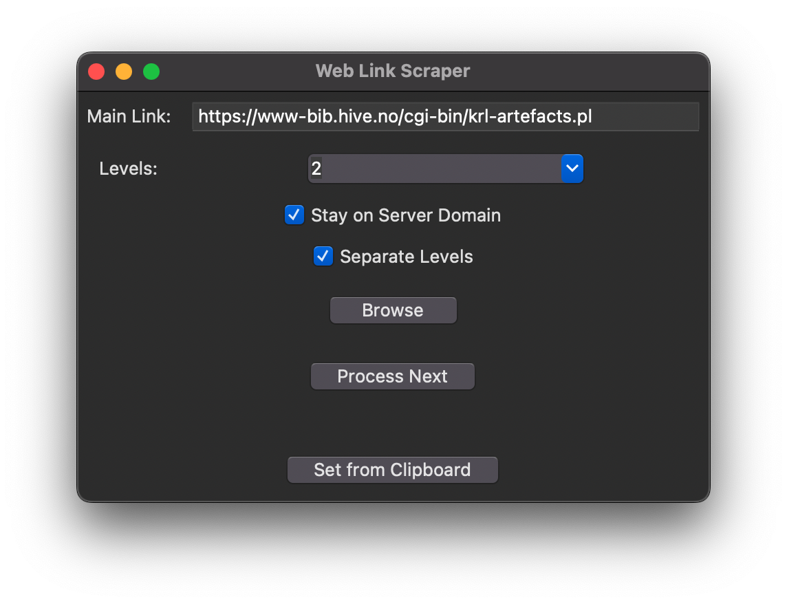

# Web Link Hierarchy Scraper to CSV

## Description


This Python script provides a graphical user interface (GUI) to scrape and save the hierarchy of links from a specified website into a CSV file. It uses the breadth-first search (BFS) algorithm to navigate through the link levels of the website.

## Features

- GUI for easy interaction
- Scrapes links from a user-specified main link
- Limits scraping to a user-defined number of levels
- Saves the unique links into a CSV file
- Avoids scraping links outside the main link's domain
- Option to set the main link from the clipboard content

## Dependencies

- `tkinter` and `tkinterdnd2` for the GUI
- `requests` for making HTTP requests
- `BeautifulSoup` from `bs4` for parsing HTML content
- `csv` for reading and writing CSV files
- `os` for file and directory operations
- `urllib.parse` for URL parsing

## Installation

Before running the script, ensure the following Python packages are installed:

```bash
pip install requests
pip install beautifulsoup4
pip install tkinterdnd2
```

## Usage

Run the script using Python:

```bash
python WebLink Scraper Hierarchy to CSV gui.py
```


### GUI Elements

- **Main Link:** Text entry for the main website URL to scrape.
- **Levels:** Dropdown to select the depth of link levels to scrape.
- **Browse:** Button to select the destination folder for the CSV file.
- **Set from Clipboard:** Button to set the main link from the current clipboard content.
- **Status Label:** Displays the status of the scraping process and the path to the saved CSV file.

### Steps

1. Enter the main link URL in the provided text entry.
2. Select the number of levels to scrape from the dropdown.
3. Click "Browse" to choose the destination folder and start the scraping process.
4. Optionally, use the "Set from Clipboard" button if you have a URL copied to your clipboard.
5. After the scraping is complete, the status label will update with the location of the saved CSV file.

## Functions

### `is_same_domain(url, seed_domain)`

Checks if the provided URL belongs to the same domain as the seed domain.

### `get_second_level_domain(url)`

Extracts the second-level domain from a given URL.

### `bfs_scrape_links(seed_url, max_levels, save_folder)`

Performs BFS to scrape links up to a specified level from a seed URL.

### `generate_file_name(seed_url, save_folder)`

Generates a unique file name based on the second-level domain and saves it in the specified folder.

### `on_submit()`

Handles the submission action from the GUI, initiates scraping, and saves the links to a CSV file.

### `set_main_link_from_clipboard()`

Sets the main link in the GUI from the content of the system clipboard.

## Note

This script is intended for educational purposes and should be used in compliance with website terms of service and legal restrictions.
